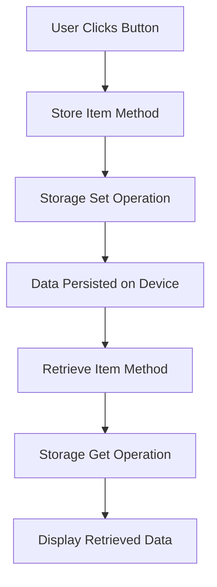

# Ionic/Angular Lab: Standalone Components and Ionic Storage

## Introduction
Ionic Storage is a powerful utility provided by Ionic Framework to store simple key-value pairs, JSON objects, or large amounts of data directly on the device. This storage solution is ideal for saving user preferences, application state, or caching data for offline use. It abstracts away complexities of working with native storage mechanisms and supports various storage engines like IndexedDB, SQLite, and local storage.

### Why Use Ionic Storage?
- **Persistence**: Stores data persistently even when the app is closed or refreshed.
- **Cross-platform Support**: Works seamlessly on Android, iOS, and the web.
- **Easy to Use**: Provides a simple API for storing and retrieving data.

In this lab, we will cover how to integrate Ionic Storage in an Angular standalone component and explore its key features through hands-on exercises.

## Syntax and Structure
The basic steps for using Ionic Storage in an Angular application are:
1. **Installation**: Install the `@ionic/storage-angular` package using npm.
2. **Initialization**: Initialize the Ionic Storage in your standalone component.
3. **Usage**: Use Ionic Storage to store, retrieve, update, and remove data.

### Installation
First, we need to install the storage package in our project:

```bash
npm install @ionic/storage-angular
```
Then we may create a new Ionic Angular Standalone project:

```bash
ionic start w5-lab-storage blank --type=angular 
```
Finally, change directory into your newly created project and serve your app. Open a new terminal in VS Code to continue issuing bash commands.

```bash
cd w5-lab-storage
ionic serve
```
### Initialization
Next, import and initialize the `Storage` in your Home component:

```typescript
import { Component, inject } from '@angular/core';
import { IonHeader, IonToolbar, IonTitle, IonContent } from '@ionic/angular/standalone';
import { IonicStorageModule, Storage  } from '@ionic/storage-angular';


@Component({
  selector: 'app-home',
  templateUrl: 'home.page.html',
  styleUrls: ['home.page.scss'],
  standalone: true,
  imports: [IonHeader, IonToolbar, IonTitle, IonContent, IonicStorageModule],
  providers: [Storage]
})
export class HomePage {
  private storage = inject(Storage); // Injecting the Storage service
  
  constructor() {}

  async ngOnInit() {
    await this.storage.create(); // Initializes the storage engine
    await this.storage.set('Name', 'John'); // Example usage of Storage
    const storedValue = await this.storage.get('Name');
    console.log('Stored Value:', storedValue);
  }
}
```

In this example, we define a standalone Angular component that initializes Ionic Storage and provides methods to save and retrieve data. Check your console log to verify the storage is working. 

## Examples

### Basic Example: Saving and Retrieving Data

```typescript
import { Component, inject } from '@angular/core';
import { IonHeader, IonToolbar, IonTitle, IonContent, IonItem, IonLabel, IonInput, IonButton, IonTextarea } from '@ionic/angular/standalone';
import { IonicStorageModule, Storage } from '@ionic/storage-angular';
import { FormsModule } from '@angular/forms';

@Component({
  selector: 'app-home',
  templateUrl: 'home.page.html',
  styleUrls: ['home.page.scss'],
  standalone: true,
  imports: [IonHeader, IonToolbar, IonTitle, IonContent, IonItem, IonLabel, IonInput, IonButton, IonTextarea, IonicStorageModule, FormsModule],
  providers: [Storage]
})
export class HomePage {
  private storage = inject(Storage);
  key: string = '';
  value: string = '';
  output: string = '';

  constructor() {}

  async ngOnInit() {
    await this.storage.create();
  }

  async setItem() {
    await this.storage.set(this.key, this.value);
    this.output = `Set ${this.key}: ${this.value}`;
  }

  async getItem() {
    const value = await this.storage.get(this.key);
    this.output = `Get ${this.key}: ${value}`;
  }
}
```
Add some buttons to call your methods and some text boxes to input data and an output string to display your data. 
```html
<ion-header>
  <ion-toolbar>
    <ion-title>Storage Demo</ion-title>
  </ion-toolbar>
</ion-header>

<ion-content class="ion-padding">
  <ion-item>
    <ion-label position="floating">Key</ion-label>
    <ion-input [(ngModel)]="key"></ion-input>
  </ion-item>
  <ion-item>
    <ion-label position="floating">Value</ion-label>
    <ion-input [(ngModel)]="value"></ion-input>
  </ion-item>
  <ion-button expand="full" (click)="setItem()">Set Item</ion-button>
  <ion-button expand="full" (click)="getItem()">Get Item</ion-button>
</ion-content>
```

### Mermaid Diagram: Data Flow for Storing and Retrieving


## Exercises

### Exercise 1: Create a New Storage Component
1. Implement the basic example above and extend it to test all of the Ionic Storage API, `set()`, `get()`, `remove()`, `clear()`, `keys()`, `length()`, `forEach()`.
2. Add buttons for each method.

### Exercise 2: Create a storage service
1. Create a new storage service that uses Ionic Storage
2. Confirm the deletion by attempting to retrieve the data after deletion.

### Exercise 2: Create a new Movies component which uses your storage service and scores movie names and the year of release.
1. Use Ionic GUI componenets to improve your UI.

## Summary and Further Reading

### Key Points
- **Ionic Storage** is a powerful solution for persisting data across app sessions.
- It supports **multiple storage engines**, which makes it flexible across platforms.
- Simple API methods: `set()`, `get()`, `remove()`, and `clear()` make it easy to use.

### Further Reading
- [Ionic Storage Documentation](https://ionicframework.com/docs/building/storage)
- [Angular Standalone Components](https://angular.io/guide/standalone-components)
- [SQLite Plugin for Advanced Storage](https://ionicframework.com/docs/native/sqlite)

Practice these exercises to strengthen your understanding of how Ionic Storage can be used to store user data efficiently in an Angular application.
