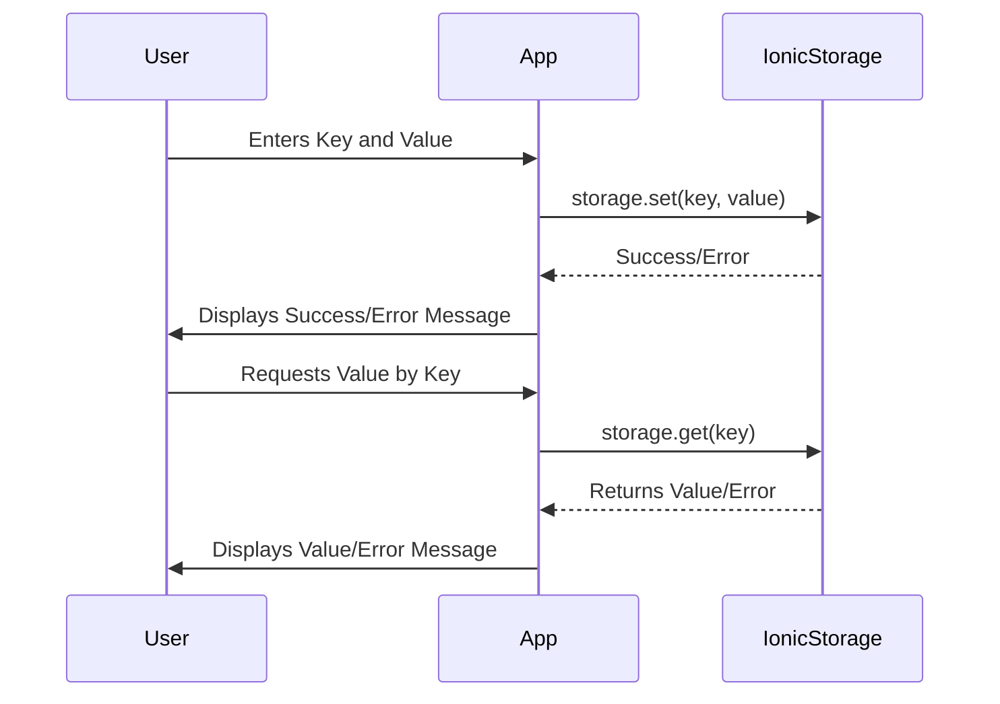

# Ionic/Angular Lab: Standalone Components and Ionic Storage

## Introduction

Ionic Storage is a powerful utility provided by the Ionic Framework for storing simple key-value pairs, JSON objects, or large amounts of data directly on the device. It's ideal for saving user preferences, application state, or caching data for offline use. It abstracts away the complexities of working with native storage mechanisms and supports various storage engines like **IndexedDB**, **localStorage**, and **SQLite**.

### Why Use Ionic Storage?

- **Persistence**: Stores data persistently even when the app is closed or refreshed.
- **Cross-platform Support**: Works seamlessly on Android, iOS, and the web.
- **Easy to Use**: Provides a simple API for storing and retrieving data.

In this lab, we'll integrate Ionic Storage in an Angular standalone component. We'll explore its key features through hands-on exercises and build a simple application that demonstrates these concepts. We'll follow best practices by initializing Ionic Storage in the `app.component.ts` file and include demonstrations of error handling using try-catch blocks.

---

## Table of Contents

1. [Setup and Installation](#setup)
2. [Initializing Ionic Storage](#initializing-storage)
3. [Using Ionic Storage Without SQLite](#using-storage)
   - [Example 1: Basic Storage Operations](#example1)
   - [DIY Exercise 1: Extending Storage Functionality](#diy1)
4. [Creating a Storage Service](#storage-service)
   - [Example 2: Abstracting Storage into a Service with Error Handling](#example2)
   - [DIY Exercise 2: Enhancing the Service](#diy2)
5. [Building a Movies App](#movies-app)
   - [Example 3: Implementing the Movies Page](#example3)
   - [DIY Exercise 3: Adding Features to the Movies App](#diy3)
6. [Introduction to SQLite (Conceptual)](#intro-sqlite)
7. [Summary and Further Reading](#summary)

---

<a name="setup"></a>
## 1. Setup and Installation

### Creating a New Ionic Angular Project

First, create a new Ionic Angular project with standalone components:

```bash
ionic start w5-lab-storage blank --type=angular --standalone
```

Navigate into your project directory and serve your app:

```bash
cd w5-lab-storage
ionic serve
```

### Installing Dependencies

We need to install the Ionic Storage package in our project:

```bash
npm install @ionic/storage-angular
```

**Note:** We are **not** installing the SQLite plugin at this stage.

---

<a name="initializing-storage"></a>
## 2. Initializing Ionic Storage

We will initialize Ionic Storage in the `main.ts` file. This ensures that Storage is initialized once when the app starts and is available throughout the entire application.

### Initialize Storage in `main.ts`

```typescript
// src/app/app.component.ts
import { bootstrapApplication } from '@angular/platform-browser';
import { RouteReuseStrategy, provideRouter, withPreloading, PreloadAllModules } from '@angular/router';
import { IonicRouteStrategy, provideIonicAngular } from '@ionic/angular/standalone';

import { routes } from './app/app.routes';
import { AppComponent } from './app/app.component';

import { Storage } from '@ionic/storage-angular';

bootstrapApplication(AppComponent, {
  providers: [
    { provide: RouteReuseStrategy, useClass: IonicRouteStrategy},
    provideIonicAngular(),
    provideRouter(routes, withPreloading(PreloadAllModules)),
    Storage,
  ],
});
```

**Explanation:**

- **Import Storage**: Import `Storage` from `@ionic/storage-angular`.
- **Inject Storage**: Inject `Storage` into the constructor.
- **Initialize Storage**: Call an asynchronous `initStorage()` method that awaits `this.storage.create()`.

---

<a name="using-storage"></a>
## 3. Using Ionic Storage Without SQLite

By default, Ionic Storage uses IndexedDB, WebSQL, or localStorage depending on availability and platform. This section will focus on using Ionic Storage with its default configuration.

<a name="example1"></a>
### Example 1: Basic Storage Operations

Let's create a simple example to save and retrieve data using Ionic Storage.

#### Step-by-Step Implementation

1. **Update `home.page.ts`**

   ```typescript
   // src/app/home/home.page.ts
   import { Component } from '@angular/core';
   import { Storage } from '@ionic/storage-angular';
   import { IonicModule } from '@ionic/angular';
   import { FormsModule } from '@angular/forms';

   @Component({
     selector: 'app-home',
     templateUrl: 'home.page.html',
     styleUrls: ['home.page.scss'],
     standalone: true,
     imports: [IonicModule, FormsModule],
   })
   export class HomePage {
     key: string = '';
     value: string = '';
     output: string = '';

     constructor(private storage: Storage) {}

     async setItem() {
       try {
         await this.storage.set(this.key, this.value);
         this.output = `Set ${this.key}: ${this.value}`;
       } catch (error) {
         console.error('Error setting item', error);
         this.output = `Error setting item: ${error}`;
       }
     }

     async getItem() {
       try {
         const value = await this.storage.get(this.key);
         this.output = `Get ${this.key}: ${value}`;
       } catch (error) {
         console.error('Error getting item', error);
         this.output = `Error getting item: ${error}`;
       }
     }
   }
   ```

   **Explanation:**

   - **Error Handling with Try-Catch**: We wrapped the `setItem()` and `getItem()` methods in `try-catch` blocks to handle potential errors gracefully.
   - **Error Messages**: In case of an error, we log it to the console and update the `output` property to inform the user.

2. **Update `home.page.html`**

   ```html
   <!-- src/app/home/home.page.html -->
   <ion-header>
     <ion-toolbar>
       <ion-title>Storage Demo</ion-title>
     </ion-toolbar>
   </ion-header>

   <ion-content class="ion-padding">
     <ion-item>
       <ion-label position="floating">Key</ion-label>
       <ion-input [(ngModel)]="key"></ion-input>
     </ion-item>
     <ion-item>
       <ion-label position="floating">Value</ion-label>
       <ion-input [(ngModel)]="value"></ion-input>
     </ion-item>
     <ion-button expand="full" (click)="setItem()">Set Item</ion-button>
     <ion-button expand="full" (click)="getItem()">Get Item</ion-button>
     <p>{{ output }}</p>
   </ion-content>
   ```

#### Mermaid Diagram: Data Flow



<a name="diy1"></a>
### DIY Exercise 1: Extending Storage Functionality

#### Objective

Enhance the basic storage operations by implementing additional methods provided by Ionic Storage, including error handling with try-catch blocks.

#### Tasks

1. **Implement Additional Methods with Error Handling**

   - Add methods for `remove()`, `clear()`, `keys()`, `length()`, and `forEach()`.
   - Wrap each method in a `try-catch` block to handle potential errors.
   - Update the `output` property and log errors to the console.

2. **Create Corresponding UI Elements**

   - Add buttons in the UI to trigger these methods.
   - Display results or confirmations for each operation.

#### Hints

- Use `await this.storage.remove(this.key);` to remove a specific item.
- Use `await this.storage.clear();` to clear all storage data.
- Use `const keys = await this.storage.keys();` to retrieve all keys.
- Use `const length = await this.storage.length();` to get the number of stored items.
- Use `await this.storage.forEach(callback);` to iterate over all items.

---

<a name="storage-service"></a>
## 4. Creating a Storage Service

Abstracting storage operations into a service promotes code reusability and maintainability.

<a name="example2"></a>
### Example 2: Abstracting Storage into a Service with Error Handling

#### Step-by-Step Implementation

1. **Generate a Storage Service**

   ```bash
   ionic generate service services/storage
   ```

2. **Implement the Storage Service with Error Handling**

   ```typescript
   // src/app/services/storage.service.ts
   import { Injectable } from '@angular/core';
   import { Storage } from '@ionic/storage-angular';

   @Injectable({
     providedIn: 'root',
   })
   export class StorageService {
     constructor(private storage: Storage) {}

     // Storage methods with error handling
     public async set(key: string, value: any) {
       try {
         await this.storage.set(key, value);
       } catch (error) {
         console.error(`Error setting key "${key}":`, error);
         throw error;
       }
     }

     public async get(key: string) {
       try {
         return await this.storage.get(key);
       } catch (error) {
         console.error(`Error getting key "${key}":`, error);
         throw error;
       }
     }

     public async remove(key: string) {
       try {
         await this.storage.remove(key);
       } catch (error) {
         console.error(`Error removing key "${key}":`, error);
         throw error;
       }
     }

     public async clear() {
       try {
         await this.storage.clear();
       } catch (error) {
         console.error('Error clearing storage:', error);
         throw error;
       }
     }

     public async keys() {
       try {
         return await this.storage.keys();
       } catch (error) {
         console.error('Error getting keys:', error);
         throw error;
       }
     }

     public async length() {
       try {
         return await this.storage.length();
       } catch (error) {
         console.error('Error getting storage length:', error);
         throw error;
       }
     }

     public async forEach(iteratorCallback: (value: any, key: string, iterationNumber: Number) => any) {
       try {
         await this.storage.forEach(iteratorCallback);
       } catch (error) {
         console.error('Error iterating over storage items:', error);
         throw error;
       }
     }

     // Utility method to check if a key exists
     public async exists(key: string): Promise<boolean> {
       try {
         const value = await this.get(key);
         return value !== null;
       } catch (error) {
         console.error(`Error checking existence of key "${key}":`, error);
         throw error;
       }
     }
   }
   ```

   **Explanation:**

   - **Try-Catch Blocks**: Each method is wrapped in a `try-catch` block to handle and log errors.
   - **Throwing Errors**: After logging, errors are re-thrown to allow calling functions to handle them if necessary.

3. **Update `home.page.ts` to Use the Service with Error Handling**

   ```typescript
   // src/app/home/home.page.ts
   import { Component } from '@angular/core';
   import { StorageService } from '../services/storage.service';
   import { IonicModule } from '@ionic/angular';
   import { FormsModule } from '@angular/forms';

   @Component({
     selector: 'app-home',
     templateUrl: 'home.page.html',
     styleUrls: ['home.page.scss'],
     standalone: true,
     imports: [IonicModule, FormsModule],
   })
   export class HomePage {
     key: string = '';
     value: string = '';
     output: string = '';

     constructor(private storageService: StorageService) {}

     async setItem() {
       try {
         await this.storageService.set(this.key, this.value);
         this.output = `Set ${this.key}: ${this.value}`;
       } catch (error) {
         console.error('Error setting item', error);
         this.output = `Error setting item: ${error}`;
       }
     }

     async getItem() {
       try {
         const value = await this.storageService.get(this.key);
         this.output = `Get ${this.key}: ${value}`;
       } catch (error) {
         console.error('Error getting item', error);
         this.output = `Error getting item: ${error}`;
       }
     }

     // Implement other methods similarly...
   }
   ```

<a name="diy2"></a>
### DIY Exercise 2: Enhancing the Service

#### Objective

Practice adding error handling using try-catch blocks in additional methods and enhance the service with utility functions.

#### Tasks

1. **Implement Error Handling in Remaining Methods**

   - Ensure that all methods (`remove`, `clear`, `keys`, `length`, `forEach`, `exists`) have appropriate try-catch blocks.
   - Log errors to the console and re-throw them if necessary.

2. **Test the Error Handling**

   - Introduce deliberate errors (e.g., use invalid keys or simulate storage failures) to see how your error handling works.
   - Ensure that your application handles errors gracefully without crashing.

3. **Update UI to Reflect Errors**

   - Modify your UI to inform users when an error occurs.
   - Provide user-friendly error messages.

#### Hints

- Use `throw error;` after logging to propagate the error.
- In your components, you can catch these errors and display messages to the user.

---

<a name="movies-app"></a>
## 5. Building a Movies App

Let's build a simple movies app that utilizes Ionic Storage without SQLite.

<a name="example3"></a>
### Example 3: Implementing the Movies Page

#### Step-by-Step Implementation

1. **Generate the Movies Page**

   ```bash
   ionic generate page pages/movies --standalone
   ```

   **Note:** When you create a page using the `ionic generate page` command, the `app.routes.ts` file is automatically updated to include the new route. You do not need to manually update it.

2. **Verify the Route**

   The `app.routes.ts` file should now include the new route automatically.

3. **Add Navigation Button in `home.page.html`**

   ```html
   <!-- src/app/home/home.page.html -->
   <ion-button expand="full" routerLink="/movies">Go to Movies</ion-button>
   ```

4. **Implement the Movies Page Logic with Error Handling**

   ```typescript
   // src/app/pages/movies/movies.page.ts
   import { Component, OnInit } from '@angular/core';
   import { StorageService } from '../../services/storage.service';
   import { IonicModule } from '@ionic/angular';
   import { FormsModule } from '@angular/forms';
   import { CommonModule } from '@angular/common';

   @Component({
     selector: 'app-movies',
     templateUrl: './movies.page.html',
     styleUrls: ['./movies.page.scss'],
     standalone: true,
     imports: [IonicModule, FormsModule, CommonModule],
   })
   export class MoviesPage implements OnInit {
     movieName: string = '';
     releaseYear: string = '';
     movies: { name: string; year: string }[] = [];
     errorMessage: string = '';

     constructor(private storageService: StorageService) {}

     async ngOnInit() {
       await this.loadMovies();
     }

     async addMovie() {
       if (this.movieName && this.releaseYear) {
         const movie = { name: this.movieName, year: this.releaseYear };
         this.movies.push(movie);
         try {
           await this.storageService.set('movies', this.movies);
           this.movieName = '';
           this.releaseYear = '';
           this.errorMessage = '';
         } catch (error) {
           console.error('Error adding movie:', error);
           this.errorMessage = 'Error adding movie. Please try again.';
         }
       } else {
         this.errorMessage = 'Movie name and release year are required.';
       }
     }

     async loadMovies() {
       try {
         const storedMovies = await this.storageService.get('movies');
         if (storedMovies) {
           this.movies = storedMovies;
         }
         this.errorMessage = '';
       } catch (error) {
         console.error('Error loading movies:', error);
         this.errorMessage = 'Error loading movies. Please try again.';
       }
     }

     async deleteMovie(index: number) {
       this.movies.splice(index, 1);
       try {
         await this.storageService.set('movies', this.movies);
         this.errorMessage = '';
       } catch (error) {
         console.error('Error deleting movie:', error);
         this.errorMessage = 'Error deleting movie. Please try again.';
       }
     }
   }
   ```

   **Explanation:**

   - **Error Handling**: Wrapped storage operations in `try-catch` blocks.
   - **User Feedback**: Set `errorMessage` to inform the user of any errors.

5. **Design the Movies Page UI**

   ```html
   <!-- src/app/pages/movies/movies.page.html -->
   <ion-header>
     <ion-toolbar>
       <ion-title>My Movies</ion-title>
     </ion-toolbar>
   </ion-header>

   <ion-content class="ion-padding">
     <ion-item>
       <ion-label position="floating">Movie Name</ion-label>
       <ion-input [(ngModel)]="movieName"></ion-input>
     </ion-item>
     <ion-item>
       <ion-label position="floating">Release Year</ion-label>
       <ion-input [(ngModel)]="releaseYear"></ion-input>
     </ion-item>
     <ion-button expand="full" (click)="addMovie()">Add Movie</ion-button>

     <ion-list>
       <ion-item-sliding *ngFor="let movie of movies; let i = index">
         <ion-item>
           <ion-label>
             <h2>{{ movie.name }}</h2>
             <p>{{ movie.year }}</p>
           </ion-label>
         </ion-item>
         <ion-item-options side="end">
           <ion-item-option color="danger" (click)="deleteMovie(i)">Delete</ion-item-option>
         </ion-item-options>
       </ion-item-sliding>
     </ion-list>

     <ion-text color="danger" *ngIf="errorMessage">
       <p>{{ errorMessage }}</p>
     </ion-text>
   </ion-content>
   ```

<a name="diy3"></a>
### DIY Exercise 3: Adding Features to the Movies App

#### Objective

Enhance the movies app by adding editing functionality, improving the UI, and handling errors gracefully.

#### Tasks

1. **Edit Movie Details with Error Handling**

   - Allow users to edit the name and release year of existing movies.
   - Implement an `ion-item-option` for editing.
   - Use `try-catch` blocks to handle errors during editing.
   - Update the `errorMessage` to inform the user of any issues.

2. **Improve UI/UX**

   - Use `ion-modal` or `ion-popover` for editing movie details.
   - Add validation to ensure that movie names and release years are not empty.
   - Display error messages for validation failures.

3. **Incorporate Ionic UI Components**

   - Use at least four different Ionic UI components in your design.
     - Examples: `ion-segment`, `ion-toggle`, `ion-checkbox`, `ion-radio`, `ion-chip`, `ion-avatar`.

#### Hints

- **Error Handling in Modals**

  - When saving changes in a modal, wrap the save operation in a `try-catch` block.
  - Provide feedback to the user if an error occurs.

- **Validation**

  - Before performing storage operations, check that all required fields are filled.
  - Inform the user if validation fails.

---

<a name="intro-sqlite"></a>
## 6. Introduction to SQLite (Conceptual)

### Understanding SQLite with Ionic Storage

While we won't implement SQLite integration during this lab due to time constraints, it's valuable to understand its role and benefits.

**SQLite** is a lightweight, file-based relational database that doesn't require a separate server process. When used with Ionic Storage, it provides:

- **Enhanced Performance**: Faster read/write operations, especially with larger datasets.
- **Improved Reliability**: Supports transactions, reducing the risk of data loss.
- **Advanced Features**: Ability to execute raw SQL queries for complex data operations.

### How to Integrate SQLite (Overview)

1. **Install the SQLite Plugin**

   ```bash
   npm install cordova-sqlite-storage
   ```

2. **Add Platforms**

   ```bash
   ionic capacitor add android
   ionic capacitor add ios
   ```

3. **Run on a Device or Emulator**

   ```bash
   ionic capacitor run android
   # or
   ionic capacitor run ios
   ```

**Note:** Ionic Storage automatically uses SQLite when the plugin is installed and the app runs on a device.

### Potential Next Steps (Self-Study)

- **Implementing SQLite Integration**

  - Follow the steps above to integrate SQLite into your app.

- **Observing Performance Improvements**

  - Test the app with larger datasets to notice performance differences.

- **Exploring Advanced Features**

  - Learn how to use direct SQLite queries for more complex data operations.

---

<a name="summary"></a>
## 7. Summary and Further Reading

### Key Points

- **Ionic Storage Initialization**: Initializing Storage in `app.component.ts` ensures it's ready for use throughout the application.
- **Ionic Storage Basics**: We learned how to use Ionic Storage without SQLite to store and retrieve data.
- **Error Handling**: Implemented error handling using try-catch blocks to make the app robust and user-friendly.
- **Creating a Storage Service**: Abstracting storage operations into a service enhances code reusability.
- **Building Applications**: Implemented a simple movies app to apply storage concepts.
- **Enhancing User Experience**: Incorporated various Ionic UI components to improve the app's interface.
- **Conceptual Understanding of SQLite**: Gained an introductory understanding of SQLite's benefits.

### Further Reading

- [Ionic Storage Documentation](https://ionicframework.com/docs/angular/storage)
- [Angular Standalone Components](https://angular.io/guide/standalone-components)
- [Ionic UI Components](https://ionicframework.com/docs/components)
- [Error Handling in Angular](https://angular.io/guide/errors)
- [Ionic Native SQLite](https://ionicframework.com/docs/native/sqlite)

---

**Practice these exercises to strengthen your understanding of how Ionic Storage can be used with default storage engines to store user data efficiently in an Angular application. Implementing error handling with try-catch blocks makes your application more robust and user-friendly.**

Feel free to explore more advanced features on your own time, such as:

- **Integrating SQLite**: Enhance your app by following the steps to integrate SQLite.
- **Data Synchronization**: Implement strategies to sync data with a backend server.
- **Direct SQLite Access**: For complex queries, consider interacting with SQLite directly.

---

**Happy Coding!**

---
